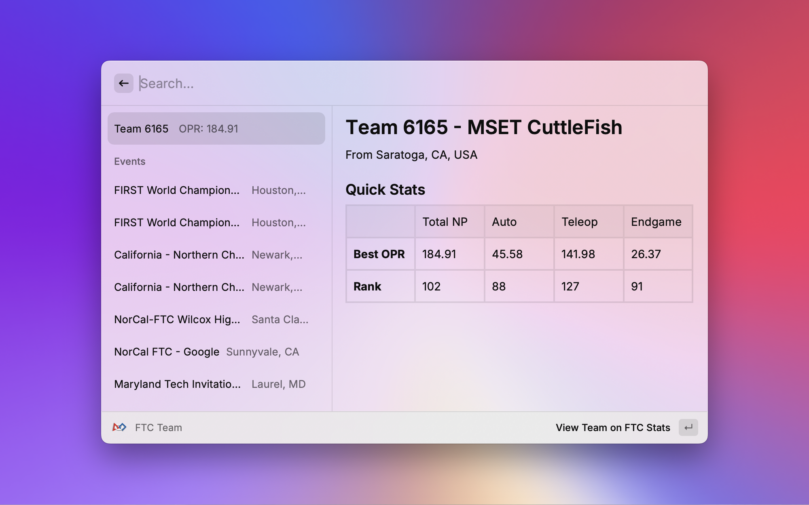
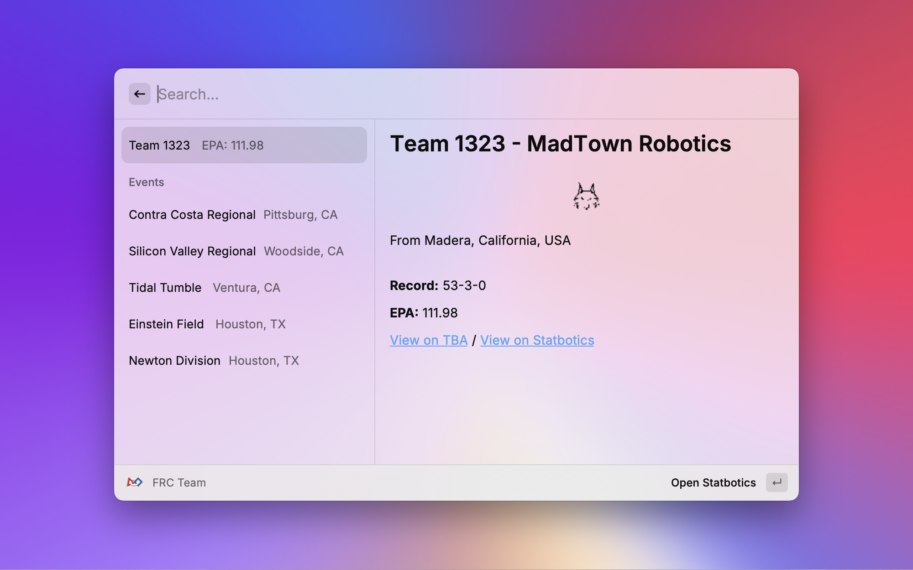

# Raycast FRC

Statistics for FIRST Robotics Competition and FIRST Tech Challenge right at your fingertips.

 

## Demo

## Features

- Search for FRC + FTC teams and events directly from Raycast
- View team stats, event results, awards, and rankings
- Specify a year for team history (optional, and only for FRC)
- Uses The Blue Alliance, Statbotics, and FTCScout APIs

## Installation
This extension is availible on the Raycast Store!
https://raycast.com/vibsthebot/raycast-frc

Get a The Blue Alliance API Key (from https://www.thebluealliance.com/account).

## Commands

- **FRC Team**: Get data about a team, including the competitions it competed in, its EPA (estimated points average), and its location (optionally specify a year to get the team's data in previous years).
- **FRC Event**: Get event data for an FRC event, including rankings, awards, and matche,s using the event key (e.g., `2025casj`, which corresponds to the 2025 Silicon Valley Regional).
- **FTC Team**: Get data for an FTC team, including all the matches it competed in and its OPR.
- **FTC Search**: Allows you to search for FTC teams and events, showing you either quick stats about a team or all the matches in an event.